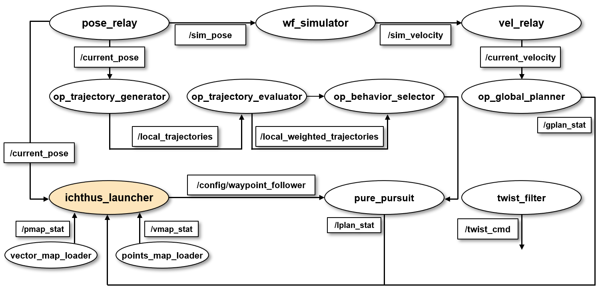

# Ichthus Launcher
Ichthus Launcher is a ROS node that launches multiple ROS nodes simultaneously, but respecting the order of ROS node dependences. It reads a task(=node) dependence graph from task_graph.yaml and launches a set of ROS nodes for each stage. The launcher does not proceed to launching the ROS nodes of the next stage without being notified that all the ROS nodes of the current stage have been successfully launched. 
The launching stages and the associcated ROS nodes should be determined by the user with knowledge of ROS node dependences.

---
## Table of Contents

- [Overview](#overview)
- [Configuration](#configuration)
- [Build](#build)
- [Dependencies](#dependencies)
- [How to launch](#how-to-launch)

---

## Overview
Ichthus launcher has two modes of operations:
* The first mode is to launch the task dependence graph in a sequence of stages according to 'task_graph.yaml'.
* The second mode is to monitor the state of ROS nodes of interest by subscribing topics of the nodes in order to react to changes of the state. For example, the state of main interest could be in which road section our target vehicle is located at and what mission has to be performed in that section. A set of road sections relating to a point map used by the launcher should be defined in 'road_graph.yaml'. 
---

## Configuration

### **task_graph.yaml**
* **task#** describes a ROS node to be executed.

|Syntax|Description|
-------|--------
|`num_tasks`|number of tasks in the task graph|
|`task_poll_interval`|time interval (in milliseconds) of polling to check if a ros node has been successfully launched|
|`stage_to_rerun`|the stage from which onwards are to be shutdown and relaunched by the launcher if needed|
|`name`|task name|
|`persist`|true if the ros node persists to run indefinitely|
|`stage`|stage number of the launching sequence implied by the task graph|
|`topic`|name of a topic of a ros node to be monitored by the launcher|
|`launch`|command line string to launch the ros node (it should be suffixed with '&' for background execution)|

* **chan#** describes a connection between tasks.

|Syntax|Description|
-------|--------
|`ptask`|publishing ros node (0 <= pnode < num_nodes)|
|`stask`|subscribing ros node (0 <= snode < num_nodes)|
|`topic`|topic name used between the two ros nodes|

* **Example: task_graph_kcity_simu.yaml**
> The following example is a task graph of nodes used in Autoware.



```yaml
###
### number of tasks in the task graph
###
num_tasks : 20

###
### Time interval (in milliseconds) of polling to check if a ros node has been executed
###
task_poll_interval : 200 

###
### The stage from which onwards are to be shut down and relaunched
###
stage_to_rerun : 1

###
### list of tasks, each describing a ros node 
### name    : name of the ros node
### persist : true if the ros node persists to run 
### stage   : stage number of the pipeline implied by the task graph
### topic   : name of the main topic of the ros node
### launch  : command line to launch the ros node (it should be suffixed with '&' for background execution)
###
task0  : { name: points_map_loader, persist: true,  stage: 0,  topic: "pmap_stat", launch: "roslaunch ichthus_launcher map_file__points_map_loader_kcity.launch &" }
task1  : { name: vector_map_loader, persist: true,  stage: 0,  topic: "vmap_stat", launch: "roslaunch ichthus_launcher map_file__vector_map_loader_kcity.launch &" }
task2  : { name: world_to_map,      persist: true,  stage: 0,  topic: "", launch: "roslaunch ichthus_launcher tf__world_to_map_kcity.launch &" }
task3  : { name: map_to_mobility,   persist: true,  stage: 0,  topic: "", launch: "roslaunch ichthus_launcher tf__map_to_mobility_kcity.launch &" }
task4  : { name: pose_relay,        persist: true,  stage: 0,  topic: "", launch: "roslaunch ichthus_launcher autoware_connector__pose_relay.launch &" }
task5  : { name: vel_relay,         persist: true,  stage: 0,  topic: "", launch: "roslaunch ichthus_launcher autoware_connector__vel_relay.launch &" }
task6  : { name: op_common_params,  persist: true,  stage: 0,  topic: "", launch: "roslaunch ichthus_launcher op_local_planner__op_common_params.launch &" }
task7  : { name: op_global_planner, persist: true,  stage: 1,  topic: "gplan_stat", launch: "roslaunch ichthus_launcher op_global_planner__op_global_planner.launch &" }
task8  : { name: rostopic,          persist: true,  stage: 1,  topic: "", launch: "bash -C /home/autoware/Autoware/src/autoware/utilities/ichthus_launcher/scripts/publish_to_stat.sh gplan_stat &" }
task9  : { name: rostopic,          persist: true,  stage: 1,  topic: "", launch: "bash -C /home/autoware/Autoware/src/autoware/utilities/ichthus_launcher/scripts/publish_to_initialpose.sh &" }
task10 : { name: rostopic,          persist: true,  stage: 1,  topic: "", launch: "bash -C /home/autoware/Autoware/src/autoware/utilities/ichthus_launcher/scripts/publish_to_goalpose.sh &" }
task11 : { name: wf_simulator,      persist: true,  stage: 2,  topic: "", launch: "roslaunch ichthus_launcher wf_simulator__wf_simulator.launch &" }
task12 : { name: op_trajectory_generator, persist: true,  stage: 2,  topic: "", launch: "roslaunch ichthus_launcher op_local_planner__op_trajectory_generator.launch &" }
task13 : { name: op_trajectory_evaluator, persist: true,  stage: 2,  topic: "", launch: "roslaunch ichthus_launcher op_local_planner__op_trajectory_evaluator.launch &" }
task14 : { name: op_behavior_selector,    persist: true,  stage: 2,  topic: "", launch: "roslaunch ichthus_launcher op_local_planner__op_behavior_selector.launch &" }
task15 : { name: pure_pursuit,      persist: true,  stage: 3,  topic: "lplan_stat", launch: "roslaunch ichthus_launcher pure_pursuit__pure_pursuit.launch &" }
task16 : { name: rostopic,          persist: true,  stage: 3,  topic: "", launch: "bash -C /home/autoware/Autoware/src/autoware/utilities/ichthus_launcher/scripts/publish_to_stat.sh lplan_stat &" }
task17 : { name: twist_filter,      persist: true,  stage: 3,  topic: "", launch: "roslaunch ichthus_launcher twist_filter__twist_filter.launch &" }
task18 : { name: twist_gate,        persist: true,  stage: 3,  topic: "", launch: "roslaunch ichthus_launcher twist_filter__twist_gate.launch &" }
task19 : { name: rviz,              persist: true,  stage: 4,  topic: "", launch: "rviz &" }

###
### list of channel, each describing the connection between two ros nodes
### ptask : publishing ros node (0 <= pnode < num_nodes)
### stask : subscribing ros node (0 <= snode < num_nodes)
### topic : topic name used between the two ros nodes
###

chan0 : { ptask: 0, stask: 19, topic: /pmap_stat } # data: True
chan1 : { ptask: 1, stask: 19, topic: /vmap_stat } # data: True

```

### **road_graph.yaml**
* **poi#** describes a point of interest (POI) in a point map. 

|Syntax|Description|
-------|--------
|`num_pois`|number of POIs|
|`name`|name of POI|

* **road#** describes a road section in a point map.

|Syntax|Description|
-------|--------
|`ep1`|first poi of a road of interest|
|`ep2`|second poi of a road of interest|
|`name`|road's name|
|`speed_limit`|max velocity of the road|
|`lookahead_ratio`|lookahead ratio of the road suitable for pure pursuit algorithm|
|`p0`, `p1`, `p2`, `p3`|four points defining the road in the point map|


* **Example: road_graph_kcity_simu.yaml**
 
```yaml

###
### number of poi's in the road graph
###
num_pois : 8

###
### list of poi's, each describing a point of interest (POI) in a map
###

poi0: { name: "start" }
poi1: { name: "end of cell0" }
poi2: { name: "end of cell1" }
poi3: { name: "end of cell2" }
poi4: { name: "end of cell3" }
poi5: { name: "end of cell4" }
poi6: { name: "end of cell5" }
poi7: { name: "finish" }

###
### list of roads, each describing a road in a map
###

road0:  {
ep1: 0,  ep2: 1,
name: "cell0",
speed_limit: 6.0,
lookahead_ratio: 2.0,
p0: [ 168.220184326, -198.675003052, 0.956642801134, 0.291263713906 ],
p1: [ 190.175506592, -156.129898071, 0.971412007052, 0.237399900073 ],
p2: [ 290.346801758, -212.831100464, 0.987794888308, 0.155760260119 ],
p3: [ 257.643493652, -254.820495605, 0.971031686599, 0.238950755638 ]
}

road1:  {
ep1: 1,  ep2: 2,
name: "cell1",
speed_limit: 7.0,
lookahead_ratio: 1.9,
p0: [ 23.6299133301, -163.97114563, 0.922969016659, 0.384874257761 ],
p1: [ 98.6222991943, -48.8962783813, 0.96419411729, 0.265197481481 ],
p2: [ 220.105834961, -124.171409607, 0.966352562352, 0.257221160163 ],
p3: [ 145.926025391, -238.190216064, 0.955644493642, 0.294522667672 ]
} 

road2:  {
ep1: 2,  ep2: 3,
name: "cell2",
speed_limit: 9.0,
lookahead_ratio: 1.6,
p0: [ -303.721252441, -109.123825073, 0.998335878992, 0.0576669118133 ],
p1: [ -310.872833252, -39.7661819458, -0.998449121723, 0.0556718181038 ],
p2: [ 112.288490295, -32.4403762817, 0.998335878992, 0.0576669118133 ],
p3: [ 54.210609436, -128.670166016, 0.997891818616, 0.0648992938294 ]
} 

road3:  {
ep1: 3,  ep2: 4,
name: "cell3",
speed_limit: 8.0,
lookahead_ratio: 1.6,
p0: [ -504.087402344, -192.236358643, -0.998249799162, 0.059138299545 ],
p1: [ -492.891479492, -49.0500183105, -0.999560861707, 0.029632477835 ],
p2: [ -300.382171631, -45.3707427979, -0.99844910845, 0.0556720561526 ],
p3: [ -284.505706787, -164.688781738, -0.999159643604, 0.0409878834877 ]
} 

road4:  {
ep1: 4,  ep2: 5,
name: "cell4",
speed_limit: 7.0,
lookahead_ratio: 1.8,
p0: [ -541.506469727, -8.30659484863, 0.729521282948, 0.683958111091 ],
p1: [ -460.808868408, 0.568786621094, 0.628374796542, 0.777910737213 ],
p2: [ -494.914916992, -194.649902344, 0.724476237495, 0.689299776081 ],
p3: [ -549.075500488, -198.836914062, 0.701523580859, 0.712646241482 ]
} 

road5:  {
ep1: 5,  ep2: 6,
name: "cell5",
speed_limit: 8.5,
lookahead_ratio: 2.0,
p0: [ 283.684265137, 28.0364532471, -0.0139758367439, 0.999902333224 ],
p1: [ 235.976257324, -26.3862457275, -0.0597299482049, 0.998214572769 ],
p2: [ -484.014404297, -36.1731987, 0.0502720004129, 0.998735563588 ],
p3: [ -480.235107422, 49.894203186, -0.0529653765073, 0.998596349328 ]
} 

road6:  {
ep1: 6,  ep2: 7,
name: "cell6",
speed_limit: 10.0,
lookahead_ratio: 1.3,
p0: [ 398.704223633, -188.301208496, -0.597233915151, 0.802067111029 ],
p1: [ 324.368408203, -247.98638916, -0.439105952023, 0.898435285871 ],
p2: [ 235.976257324, -26.3862457275, -0.0597299482049, 0.998214572769 ],
p3: [ 283.684265137, 28.0364532471, -0.0139758367439, 0.999902333224 ]
} 

```

* **Pictorial representation of road 0**
```yaml
road0:  {
ep1: 0,  ep2: 1,
name: "cell0",
speed_limit: 6.0,
lookahead_ratio: 2.0,
p0: [ 168.220184326, -198.675003052, 0.956642801134, 0.291263713906 ],
p1: [ 190.175506592, -156.129898071, 0.971412007052, 0.237399900073 ],
p2: [ 290.346801758, -212.831100464, 0.987794888308, 0.155760260119 ],
p3: [ 257.643493652, -254.820495605, 0.971031686599, 0.238950755638 ]
}
```


---

## Build
As usual with Colcon,
```
cd colcon_ws/src
git clone https://github.com/ICHTHUS-SSU/ichthus_launcher.git
cd ..
colcon build --packages-select ichthus_launcher --cmake-args -DCMAKE_BUILD_TYPE=Release
```
Otherwise,
```
cd catkin_ws/src
git clone https://github.com/ICHTHUS-SSU/ichthus_launcher.git
cd ..
catkin_make
```

---

## Dependencies
* `ROS`
* `Boost`

---

## How to use
1. Create a task_graph.yaml, road_graph.yaml for the set of ROS nodes you want to run.
2. Create a launch file to run each ROS node.
3. Execute the ichthus Launcher as follows.

`roslaunch ichthus_launcher ichthus_launcher.launch`

---
